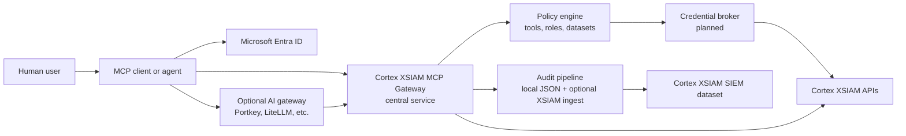
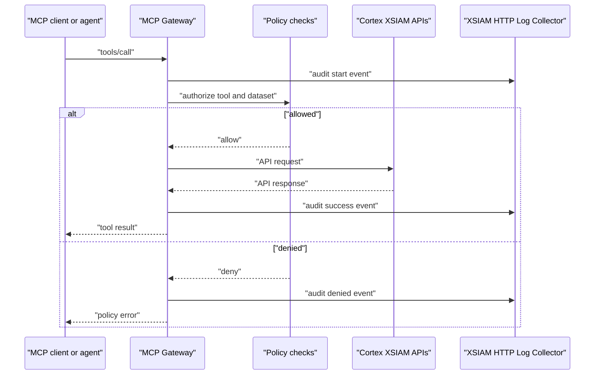

# Cortex XSIAM MCP Gateway

[](https://github.com/ciaran-finnegan/cortex-xsiam-mcp-gateway/actions/workflows/ci.yml)
[](https://github.com/ciaran-finnegan/cortex-xsiam-mcp-gateway/actions/workflows/codeql.yml)
[](https://github.com/ciaran-finnegan/cortex-xsiam-mcp-gateway/actions/workflows/scorecard.yml)

An enterprise-oriented MCP gateway for Cortex XSIAM security operations. The
goal is a centrally deployed MCP service where users authenticate through
Microsoft Entra ID, agents can search logs and investigation data, and every
tool call is governed by policy and audit logging rather than by a shared local
API key.

This project is a community fork and hardening track for Palo Alto Networks'
Cortex MCP server. It keeps the useful Cortex/XSIAM tool surface, then adds the
enterprise controls needed for multi-user agent access: dataset-scoped log
search, raw XQL restrictions, structured audit events, optional forwarding into
Cortex XSIAM, and a roadmap for Entra-backed identity and role enforcement.

Portkey, LiteLLM, and similar AI gateways are supported deployment patterns, not
mandatory dependencies. Use one when it is already your enterprise AI control
plane for model routing, identity forwarding, prompt logging, or usage policy.
Skip it when MCP clients can authenticate directly to this service with Entra
ID.

## Alpha Status

Release line: `v0.1.0-alpha.1`.

This is alpha software. It is appropriate for design review, lab validation, and
controlled pilot work. It is not ready for unrestricted enterprise production
exposure until the alpha blockers in [Roadmap](docs/ROADMAP.md) are complete.

Implemented in this fork:

- FastMCP server with `stdio` and `streamable-http` transports.
- XSIAM API key based server-to-XSIAM authentication.
- XQL execution and result polling.
- Agent-oriented log search guidance, dataset discovery, and XQL-backed field
  discovery.
- `search_logs` for raw XQL, structured filters, and an experimental
  natural-language fallback.
- Dataset allowlist enforcement for `search_logs`.
- Privileged-group restriction for the legacy `execute_xql_query` tool.
- Structured audit logging for every MCP tool invocation.
- Optional audit export to a Cortex XSIAM HTTP Log Collector.
- XSIAM tools for cases, issues, tenant info, assets, endpoints,
  vulnerabilities, and assessment profile results.
- CI, CodeQL, Dependency Review, Dependabot, OpenSSF Scorecard, and AI review
  configuration scaffolding.

Alpha blockers:

- Entra ID token validation for HTTP transport.
- Optional trusted identity-forwarding validation for Portkey, LiteLLM, and
  similar gateways.
- Tool-level policy for every MCP tool beyond the current log-search and raw
  XQL controls.
- Role-to-XSIAM-credential brokering.
- FastMCP 3 compatibility work to remove vulnerable FastMCP 2.x transitive
  dependency paths.

## Enterprise Architecture

The intended production shape is a centrally hosted MCP service. Analysts and
agents connect to one controlled endpoint rather than each user running a local
server with broad XSIAM credentials.



Two deployment modes are supported by design:

- Direct mode: the MCP client authenticates with Entra ID and calls this server.
  The server validates Entra tokens and applies policy. Token validation is an
  alpha blocker, not complete today.
- Gateway mode: an optional AI gateway authenticates the user and forwards
  verifiable identity claims. The MCP server must validate that forwarding
  contract before trusting the claims. This is also an alpha blocker.

Local deployment is only for development, demos, and isolated trusted analyst
workflows. A local-per-user MCP process with broad API credentials is not the
enterprise target because it weakens central identity, audit, policy, and
credential control.

See [Enterprise Deployment](docs/ENTERPRISE_DEPLOYMENT.md) and
[Security Model](docs/SECURITY_MODEL.md).

## Why Not Just The Current Palo Alto MCP Server?

Palo Alto publishes an official
[Cortex MCP server overview](https://docs-cortex.paloaltonetworks.com/r/Cortex-XSIAM/Cortex-XSIAM-3.x-Documentation/Cortex-MCP-server-overview)
and introduced the project in
[Introducing the Cortex MCP Server](https://www.paloaltonetworks.com/blog/security-operations/introducing-the-cortex-mcp-server/).
Those materials describe a flexible MCP server that can be used with clients
such as Claude Desktop and can query or retrieve Cortex issues, cases, assets,
endpoints, compliance results, and tenant metadata.

Based on the current public docs and the forked codebase, the official server is
best understood as a local or trusted-client enablement path. That is useful,
but it leaves several enterprise questions outside the default design:

- How are many users authenticated to one shared MCP service?
- How are Entra groups or app roles mapped to XSIAM roles?
- How does a non-security user get limited to approved datasets?
- How is raw XQL restricted to security/admin roles?
- How does the server avoid every user needing a personally managed XSIAM API
  key?
- How are agent actions auditable back to a human principal?
- How can audit events be sent into Cortex XSIAM as SIEM data?

This fork addresses the first layer of those gaps now and tracks the rest as
alpha blockers.

## Core Tools

| Tool | Purpose | Current control |
| --- | --- | --- |
| `get_log_search_guidance` | Return compact instructions for LLM agents using XSIAM log search. | Audited. |
| `list_log_datasets` | Discover datasets the current principal is allowed to query. | Dataset allowlist policy, capped output. |
| `discover_log_fields` | Run a bounded XQL sample against one allowed dataset and return observed fields. | Dataset allowlist policy, capped output, no sample values. |
| `search_logs` | Search XSIAM logs using raw XQL, structured filters, or experimental natural-language templates. | Dataset allowlist policy. |
| `execute_xql_query` | Execute analyst-authored raw XQL. | Restricted to `RAW_XQL_PRIVILEGED_GROUPS`. |
| `get_xql_query_quota` | Retrieve XQL query quota usage. | Audited. |
| `get_issues` | Search XSIAM issues/alerts. | Audited; tool-level authorization pending. |
| `get_cases` | Search XSIAM cases/incidents. | Audited; tool-level authorization pending. |
| `get_tenant_info` | Retrieve tenant/license information. | Audited; tool-level authorization pending. |
| `get_assets`, `get_asset_by_id` | Retrieve asset inventory data. | Audited; tool-level authorization pending. |
| `get_filtered_endpoints` | Retrieve endpoint data. | Audited; tool-level authorization pending. |
| `get_vulnerabilities` | Retrieve vulnerability data. | Audited; tool-level authorization pending. |
| `get_assessment_profile_results` | Retrieve assessment profile results. | Audited; tool-level authorization pending. |

## Log Search

### Agent-Driven Plain English

The primary enterprise path is agent-driven:

1. The user asks a plain-English question.
2. The LLM agent calls `get_log_search_guidance`.
3. The agent calls `list_log_datasets` to find allowed candidate datasets.
4. The agent calls `discover_log_fields` for one candidate dataset to learn
   observed field names and types from a bounded XQL sample.
5. The agent calls `search_logs` with explicit `dataset`, `filters`, `fields`,
   `timeframe`, and a low `limit`.

This keeps natural-language reasoning in the client/agent while keeping the MCP
server focused on policy, compact discovery, XQL execution, and audit logging.

See [Agent Log Search](docs/AGENT_LOG_SEARCH.md).

### Raw XQL

Use `query` for advanced analysts who already know XQL:

```json
{
  "dataset": "xdr_data",
  "query": "dataset = xdr_data | filter event_type contains \"authentication\" | limit 100"
}
```

The explicit `dataset` parameter is required for deterministic dataset policy
checks. Do not infer authorization by trying to parse arbitrary XQL.

### Structured Search

Use `dataset`, `filters`, `fields`, and `limit` for routine agent workflows:

```json
{
  "dataset": "xdr_data",
  "filters": [
    {"field": "event_type", "operator": "contains", "value": "authentication"},
    {"field": "severity", "operator": "in", "value": ["high", "critical"]}
  ],
  "fields": ["event_id", "event_type", "severity"],
  "limit": 100
}
```

### Experimental Natural Language Fallback

`natural_language_query` exists for simple common SOC patterns, but it is not
the preferred enterprise path. LLM agents should normally translate user intent
into structured `search_logs` arguments after using discovery tools.

```json
{
  "dataset": "xdr_data",
  "natural_language_query": "failed login for user alice on host laptop-01 from 192.0.2.10 in the last 24 hours",
  "limit": 50
}
```

The fallback translator is intentionally conservative. It handles common terms
such as failed login/authentication, severity, username, host, IPv4 address, and
relative windows like `last 24 hours`. Ambiguous prompts are refused rather than
converted into speculative XQL.

See [Natural Language XQL](docs/NATURAL_LANGUAGE_XQL.md).

## Dataset Authorization

Configure dataset access with `LOG_SEARCH_DATASET_POLICY`.

```json
{
  "Security": ["*"],
  "Tier1": ["xdr_data"],
  "CloudTeam": ["xdr_data", "cloud_audit_logs"]
}
```

- `Security` can query every dataset.
- `Tier1` can query only `xdr_data`.
- `CloudTeam` can query `xdr_data` and `cloud_audit_logs`.

Until incoming identity is implemented, development deployments can set default
groups:

```bash
export LOG_SEARCH_DEFAULT_PRINCIPAL_ID="dev-analyst@example.com"
export LOG_SEARCH_DEFAULT_GROUPS="Security"
```

Production groups must come from verified identity claims, not development
defaults.

## Audit Logging

Every MCP tool invocation emits structured JSON audit events. Events include the
human principal known to the server, groups, tool name, transport, outcome,
duration, argument names, dataset, query hash, and XSIAM API key ID hash. Raw
XQL and natural-language prompts are hashed by default and can be logged only by
explicit opt-in.



Optional Cortex XSIAM SIEM integration uses an XSIAM HTTP Log Collector. Palo
Alto documents HTTP collectors as a way to receive third-party logs in JSON,
Raw, CEF, or LEEF format at `/logs/v1/event`; see
[Set up an HTTP log collector to receive logs](https://docs-cortex.paloaltonetworks.com/r/Cortex-XSIAM/Cortex-XSIAM-3.x-Documentation/Set-up-an-HTTP-log-collector-to-receive-logs).

See [Audit Logging](docs/AUDIT_LOGGING.md).

## Configuration

Required:

```bash
export CORTEX_MCP_PAPI_URL="https://api-your-xsiam-tenant.example"
export CORTEX_MCP_PAPI_AUTH_HEADER="your-api-key"
export CORTEX_MCP_PAPI_AUTH_ID="your-api-key-id"
```

Common optional settings:

```bash
export MCP_TRANSPORT="streamable-http"
export MCP_HOST="0.0.0.0"
export MCP_PORT="8080"
export MCP_PATH="/api/v1/stream/mcp"
export LOG_SEARCH_DATASET_POLICY='{"Security":["*"],"Tier1":["xdr_data"]}'
export RAW_XQL_PRIVILEGED_GROUPS="Security,Admin"
```

Audit export to Cortex XSIAM:

```bash
export AUDIT_LOG_ENABLED="true"
export AUDIT_LOG_XSIAM_HTTP_COLLECTOR_ENABLED="true"
export AUDIT_LOG_XSIAM_HTTP_COLLECTOR_URL="https://api-your-xsiam-tenant.example/logs/v1/event"
export AUDIT_LOG_XSIAM_HTTP_COLLECTOR_API_KEY="collector-api-key"
```

See [Configuration](docs/CONFIGURATION.md).

## Dependency And Security Automation

Dependabot is the primary dependency update system for this repository.
Renovate is not enabled in the repo. Running both without a clear split would
create duplicate PRs and noisy dependency policy. If Renovate is adopted later,
it should replace Dependabot or be scoped to a Renovate-only feature that
Dependabot does not support.

The repository includes:

- CI on Python 3.12 and 3.13.
- CodeQL analysis.
- Dependency Review with high-severity blocking.
- Dependabot version/security updates.
- Dependabot workflow to enable auto-merge for passing patch/minor updates,
  subject to branch protection.
- OpenSSF Scorecard.
- Security policy and private vulnerability reporting guidance.

Current known dependency issue: the FastMCP 2.x line carries Dependabot alerts
that require FastMCP 3.x compatibility work. A direct upgrade has already shown
breaking import/runtime changes, so this is tracked as an alpha blocker rather
than hidden as a simple version bump.

See [Dependency Remediation](docs/DEPENDENCY_REMEDIATION.md).

## AI Review Automation

The repo contains review instructions/configuration for four review paths:

- Codex: `AGENTS.md` plus a GitHub Actions workflow that runs when
  `OPENAI_API_KEY` is configured.
- Claude: `CLAUDE.md`, `REVIEW.md`, and a workflow that runs when
  `ANTHROPIC_API_KEY` is configured.
- CodeRabbit: `.coderabbit.yaml`.
- GitHub Copilot: `.github/copilot-instructions.md` and path-specific review
  instructions.

These integrations still require the relevant GitHub app, repository setting,
or secret to be enabled in GitHub. The workflow files skip safely when secrets
are not present.

See [AI Review](docs/AI_REVIEW.md).

## Local Development

Local execution is for development and isolated testing only. It is not the
recommended enterprise deployment model.

Requirements:

- Python 3.12 or 3.13. Python 3.14 is not currently supported by all native
  dependencies.
- Poetry.

Install:

```bash
poetry env use python3.12
poetry install
```

Run checks:

```bash
poetry run pytest
poetry run ruff check src tests
```

Run the MCP server locally:

```bash
poetry run python src/main.py
```

For Claude Desktop or Cursor development, configure the MCP client to execute
`poetry run python src/main.py` or run the Docker image.

## Docker

```bash
docker build -t cortex-xsiam-mcp-gateway .
docker run --rm -i --env-file .env cortex-xsiam-mcp-gateway
```

## Releases

The first release line is `v0.1.0-alpha.1`. Alpha releases are expected to be
pre-production and may include breaking changes before beta. See
[Release Process](docs/RELEASES.md) and [Changelog](CHANGELOG.md).

## Licensing

This repository contains upstream code made available under the Palo Alto
Networks Cortex Communication Python Files License 1.0. That license permits
derivative works only for use with Palo Alto Networks Cortex XSIAM, Cortex
Cloud, Cortex XDR, and AgentiX products, and it imposes redistribution
requirements.

New separable project additions in this fork, including documentation, tests,
GitHub workflow configuration, and original glue code added for dataset policy
and gateway hardening, are offered under Apache License 2.0 where legally
separable from the upstream work.

The combined repository must still comply with the upstream Palo Alto Networks
license. See [NOTICE](NOTICE.md), [LICENSE](LICENSE), and
[Apache-2.0](LICENSES/Apache-2.0.txt).

This is a licensing summary, not legal advice.

## Project Governance

See:

- [Contributing](CONTRIBUTING.md)
- [Security Policy](SECURITY.md)
- [Governance](GOVERNANCE.md)
- [Roadmap](docs/ROADMAP.md)

## Disclaimer

This is a community project. It is not officially supported by Palo Alto
Networks. Use it with least-privilege credentials and test it in non-production
tenants before using it in production workflows.
