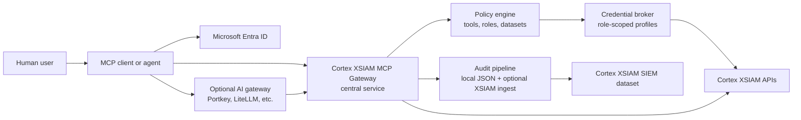
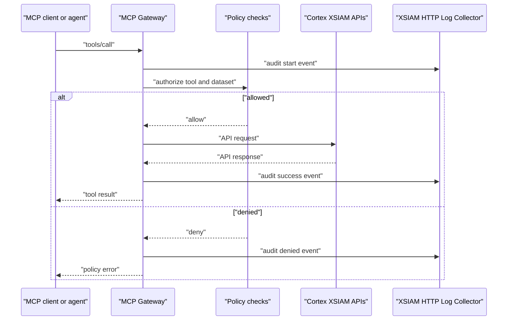

# Cortex XSIAM MCP Gateway

[](https://github.com/ciaran-finnegan/cortex-xsiam-mcp-gateway/actions/workflows/ci.yml)
[](https://github.com/ciaran-finnegan/cortex-xsiam-mcp-gateway/actions/workflows/codeql.yml)
[](https://github.com/ciaran-finnegan/cortex-xsiam-mcp-gateway/actions/workflows/scorecard.yml)

An enterprise-oriented MCP gateway for governed access to Cortex XSIAM data.
The goal is a centrally deployed MCP service where users authenticate through
Microsoft Entra ID, agents can query security and non-security datasets, and every
tool call is governed by policy and audit logging rather than by a shared local
API key.

This project is a community fork and hardening track for Palo Alto Networks'
Cortex MCP server. It keeps the useful Cortex/XSIAM tool surface, then adds the
enterprise controls needed for multi-user agent access: Entra-backed identity,
optional trusted gateway identity forwarding, tool policy, dataset-scoped log
search, raw XQL restrictions, role-scoped credential selection, structured
audit events, and optional forwarding into Cortex XSIAM.

Portkey, LiteLLM, and similar AI gateways are supported deployment patterns, not
mandatory dependencies. Use one when it is already your enterprise AI control
plane for model routing, identity forwarding, prompt logging, or usage policy.
Skip it when MCP clients can authenticate directly to this service with Entra
ID.

## Alpha Status

Release line: `v0.2.0-alpha.1`.

This is alpha software. It is appropriate for design review, lab validation, and
controlled pilot work. It is not ready for unrestricted enterprise production
exposure until the remaining alpha blockers in [Roadmap](docs/ROADMAP.md) are
complete and validated in your tenant.

Implemented in this fork:

- FastMCP 3 server with `stdio` and `streamable-http` transports.
- XSIAM API key based server-to-XSIAM authentication.
- XQL execution and result polling.
- Agent-oriented dataset guidance, policy-filtered discovery, and XQL-backed field
  discovery.
- `query_dataset` for typed row projection, filters, aggregations, top-N, and
  time-bucketed trends across any policy-allowed XSIAM dataset.
- Encrypted, principal-bound keyset continuation for bounded row pagination.
- Server-side row, field, cell, byte, timeframe, and concurrency limits.
- Dataset allowlist enforcement before discovery, compilation, or execution.
- Privileged-group restriction for the legacy `execute_xql_query` tool.
- Entra ID JWT validation for HTTP transport.
- Optional HMAC-signed trusted gateway identity forwarding for Portkey,
  LiteLLM, and similar gateways.
- Tool-level policy for every MCP tool.
- Role/group-scoped XSIAM credential selection from pre-provisioned profiles.
- Structured audit logging for every MCP tool invocation.
- Optional audit export to a Cortex XSIAM HTTP Log Collector.
- FastMCP 3.4 compatibility with the vulnerable FastMCP 2.x `diskcache`
  dependency path removed from the lockfile.
- Unit, security, MCP-schema, blind Codex planning, and opt-in live XSIAM tests.
- XSIAM tools for cases, issues, tenant info, assets, endpoints,
  vulnerabilities, and assessment profile results.
- CI, CodeQL, Dependency Review, Dependabot, OpenSSF Scorecard, and AI review
  configuration scaffolding.

Alpha blockers:

- Tenant-specific validation of Entra, optional gateway, credential broker,
  and audit collector configurations before each production rollout.
- Field-level output redaction.
- Streaming XQL result retrieval for large investigations.
- Distributed rate limiting and cursor/replay state for multi-replica deployments.

## Enterprise Architecture

The intended production shape is a centrally hosted MCP service. Analysts and
agents connect to one controlled endpoint rather than each user running a local
server with broad XSIAM credentials.



Two deployment modes are supported by design:

- Direct mode: the MCP client authenticates with Entra ID and calls this server.
  The server validates Entra tokens and applies policy.
- Gateway mode: an optional AI gateway authenticates the user and forwards
  verifiable identity claims. The MCP server must validate that forwarding
  contract before trusting the claims.

Local deployment is only for development, demos, and isolated trusted analyst
workflows. A local-per-user MCP process with broad API credentials is not the
enterprise target because it weakens central identity, audit, policy, and
credential control.

See [Enterprise Deployment](docs/ENTERPRISE_DEPLOYMENT.md) and
[Security Model](docs/SECURITY_MODEL.md).

## Why Not Just The Current Palo Alto MCP Server?

Palo Alto publishes an official
[Cortex MCP server overview](https://docs-cortex.paloaltonetworks.com/r/Cortex-XSIAM/Cortex-XSIAM-3.x-Documentation/Cortex-MCP-server-overview)
and introduced the project in
[Introducing the Cortex MCP Server](https://www.paloaltonetworks.com/blog/security-operations/introducing-the-cortex-mcp-server/).
Those materials describe a flexible MCP server that can be used with clients
such as Claude Desktop and can query or retrieve Cortex issues, cases, assets,
endpoints, compliance results, and tenant metadata.

Based on the current public docs and the forked codebase, the official server is
best understood as a local or trusted-client enablement path. That is useful,
but it leaves several enterprise questions outside the default design:

- How are many users authenticated to one shared MCP service?
- How are Entra groups or app roles mapped to XSIAM roles?
- How does a non-security user get limited to approved datasets?
- How is raw XQL restricted to security/admin roles?
- How does the server avoid every user needing a personally managed XSIAM API
  key?
- How are agent actions auditable back to a human principal?
- How can audit events be sent into Cortex XSIAM as SIEM data?

This fork addresses the first layer of those gaps now and tracks deeper
production hardening in the roadmap.

| Enterprise concern | Public upstream material | This gateway |
| --- | --- | --- |
| Shared service identity | Client setup and Cortex API credentials are documented; a multi-user Entra authorization model is not described. | Entra JWT validation or signed optional-gateway assertions. |
| Per-user authorization | Cortex permissions still apply to the API credential used by the server. | MCP tool policy plus explicit dataset policy derived from verified groups/app roles. |
| Users without XSIAM API keys | Per-user key lifecycle is not solved by the public MCP overview. | Shared service credential or deterministic pre-provisioned role profiles; no dynamic user-key creation required. |
| Plain-English dataset questions | General MCP tools and XQL access are available. | Progressive dataset/field discovery and a typed query compiler tested with a blind client-agent evaluation. |
| Result volume and pagination | XQL result APIs expose bounded and streaming retrieval primitives. | Low default limits, byte/cell/field caps, four-query concurrency ceiling, and encrypted keyset cursors. |
| Human-attributable audit | Cortex API activity can identify the API credential. | Every MCP tool invocation records the verified principal and selected credential profile, with optional XSIAM collector export. |

## Core Tools

| Tool | Purpose | Current control |
| --- | --- | --- |
| `get_dataset_query_guidance` | Return compact instructions for LLM agents querying XSIAM datasets. | Tool policy and audit. |
| `list_log_datasets` | Discover datasets the current principal is allowed to query. | Tool policy, dataset allowlist policy, capped output. |
| `discover_log_fields` | Run a bounded XQL sample against one allowed dataset and return observed fields. | Tool policy, dataset allowlist policy, capped output, no sample values. |
| `query_dataset` | Execute a typed row or aggregate plan for one explicit dataset. | Tool policy, dataset policy, compiler allowlists, output budgets. |
| `continue_dataset_query` | Retrieve one bounded next page using an opaque keyset cursor. | Cursor encryption, principal/group/policy binding, policy recheck. |
| `get_xql_help` | Return one compact XQL/typed-query recipe to the client agent. | No tenant data; tool policy and audit. |
| `search_logs` | Compatibility wrapper for simple typed row searches. | Explicit dataset, required fields, dataset policy; no raw query argument. |
| `execute_xql_query` | Execute analyst-authored raw XQL. | Tool policy, privileged groups, and an all-datasets policy grant. |
| `get_xql_query_quota` | Retrieve XQL query quota usage. | Tool policy and audit. |
| `get_issues` | Search XSIAM issues/alerts. | Tool policy and audit. |
| `get_cases` | Search XSIAM cases/incidents. | Tool policy and audit. |
| `get_tenant_info` | Retrieve tenant/license information. | Tool policy and audit. |
| `get_assets`, `get_asset_by_id` | Retrieve asset inventory data. | Tool policy and audit. |
| `get_filtered_endpoints` | Retrieve endpoint data. | Tool policy and audit. |
| `get_vulnerabilities` | Retrieve vulnerability data. | Tool policy and audit. |
| `get_assessment_profile_results` | Retrieve assessment profile results. | Tool policy and audit. |

## Agent Dataset Queries

### Claude Code Or Codex Agent Workflow

The primary enterprise path is agent-driven:

1. The user asks a plain-English question.
2. The LLM agent calls `get_dataset_query_guidance`.
3. The agent calls `list_log_datasets` to find allowed candidate datasets.
4. The agent calls `discover_log_fields` for one candidate dataset to learn
   observed field names and types from a bounded XQL sample.
5. The agent calls `query_dataset` with an explicit dataset and either a typed
   row plan or aggregate plan.
6. The agent summarizes the bounded result and follows a continuation cursor
   only when the user actually requests more.

This keeps plain-English reasoning in Claude Code, Codex, or another MCP client
agent while keeping the MCP server focused on policy, compact discovery, XQL
execution, and audit logging. The server does not accept natural-language log
queries.

See [Agent Log Search](docs/AGENT_LOG_SEARCH.md) and
[Claude Code/Codex Log Search Testing](docs/CLAUDE_CODE_LOG_SEARCH_TESTING.md).

### Raw XQL

Raw XQL is an exceptional escape hatch for advanced analysts:

```json
{
  "query": "dataset = xdr_data | filter event_type contains \"authentication\" | fields event_id, event_type | limit 25",
  "result_limit": 25,
  "timeframe": {"relativeTime": 86400000}
}
```

Because raw XQL can join or subquery multiple datasets, `execute_xql_query`
requires both membership in `RAW_XQL_PRIVILEGED_GROUPS` and a `*` dataset grant.
It also requires a terminal numeric `| limit N` stage, which the server clamps
to its result policy before submitting the query. Routine Claude Code/Codex
workflows should use `query_dataset`.

### Structured Search

Use rows mode for targeted records:

```json
{
  "dataset": "xdr_data",
  "mode": "rows",
  "filters": [
    {"field": "event_type", "operator": "contains", "value": "authentication"},
    {"field": "severity", "operator": "in", "value": ["high", "critical"]}
  ],
  "fields": ["event_id", "event_type", "severity"],
  "timeframe": {"relative_ms": 86400000},
  "limit": 25
}
```

Use aggregate mode when the question asks for counts, top values, averages, or
trends, so raw records do not consume model context unnecessarily:

```json
{
  "dataset": "asset_inventory",
  "mode": "aggregate",
  "metrics": [{"function": "count", "alias": "total"}],
  "group_by": ["os_family"],
  "order_by": [{"field": "total", "direction": "desc"}],
  "limit": 10
}
```

## Dataset Authorization

Configure dataset access with `LOG_SEARCH_DATASET_POLICY`.

```json
{
  "Security": ["*"],
  "Tier1": ["xdr_data"],
  "CloudTeam": ["xdr_data", "cloud_audit_logs"]
}
```

- `Security` can query every dataset.
- `Tier1` can query only `xdr_data`.
- `CloudTeam` can query `xdr_data` and `cloud_audit_logs`.

For local development and stdio-only testing, default groups can be configured:

```bash
export LOG_SEARCH_DEFAULT_PRINCIPAL_ID="dev-analyst@example.com"
export LOG_SEARCH_DEFAULT_GROUPS="Security"
```

Production HTTP deployments should use `MCP_IDENTITY_AUTH_MODE=entra`,
`gateway`, or `entra_or_gateway`; groups must come from verified identity
claims, not development defaults.

## Incoming Identity And Tool Policy

HTTP deployments can validate identity in two ways:

- `MCP_IDENTITY_AUTH_MODE=entra`: validate an Entra-issued bearer JWT using the
  configured issuer, audience, and JWKS.
- `MCP_IDENTITY_AUTH_MODE=gateway`: validate HMAC-signed identity headers from a
  trusted AI gateway.
- `MCP_IDENTITY_AUTH_MODE=entra_or_gateway`: accept either validated path.

Tool access is controlled with `TOOL_ACCESS_POLICY`, a JSON mapping from Entra
group IDs, app roles, or trusted gateway groups to allowed tool names. Use `*`
only for high-trust admin/security groups.

XSIAM credentials are not dynamically provisioned per user. When
`XSIAM_CREDENTIAL_BROKER_ENABLED=true`, the gateway selects from
pre-provisioned least-privilege API key profiles by group/role. The public
configuration references environment variable names for each credential; the
secret values stay in your secret manager or local environment.

## Audit Logging

Every MCP tool invocation emits structured JSON audit events. Events include the
human principal known to the server, groups, tool name, transport, outcome,
duration, argument names, dataset, query hash, and XSIAM API key ID hash. Raw
XQL is hashed by default and can be logged only by explicit opt-in.



Optional Cortex XSIAM SIEM integration uses an XSIAM HTTP Log Collector. Palo
Alto documents HTTP collectors as a way to receive third-party logs in JSON,
Raw, CEF, or LEEF format at `/logs/v1/event`; see
[Set up an HTTP log collector to receive logs](https://docs-cortex.paloaltonetworks.com/r/Cortex-XSIAM/Cortex-XSIAM-3.x-Documentation/Set-up-an-HTTP-log-collector-to-receive-logs).

See [Audit Logging](docs/AUDIT_LOGGING.md).

## Configuration

Required:

```bash
export CORTEX_MCP_PAPI_URL="https://api-your-xsiam-tenant.example"
export CORTEX_MCP_PAPI_AUTH_HEADER="your-api-key"
export CORTEX_MCP_PAPI_AUTH_ID="your-api-key-id"
```

Common optional settings:

```bash
export MCP_TRANSPORT="streamable-http"
export MCP_HOST="0.0.0.0"
export MCP_PORT="8080"
export MCP_PATH="/api/v1/stream/mcp"
export LOG_SEARCH_DATASET_POLICY='{"Security":["*"],"Tier1":["xdr_data"]}'
export RAW_XQL_PRIVILEGED_GROUPS="Security,Admin"
```

Audit export to Cortex XSIAM:

```bash
export AUDIT_LOG_ENABLED="true"
export AUDIT_LOG_XSIAM_HTTP_COLLECTOR_ENABLED="true"
export AUDIT_LOG_XSIAM_HTTP_COLLECTOR_URL="https://api-your-xsiam-tenant.example/logs/v1/event"
export AUDIT_LOG_XSIAM_HTTP_COLLECTOR_API_KEY="collector-api-key"
```

See [Configuration](docs/CONFIGURATION.md).

## Dependency And Security Automation

Dependabot is the primary dependency update system for this repository.
Renovate is not enabled in the repo. Running both without a clear split would
create duplicate PRs and noisy dependency policy. If Renovate is adopted later,
it should replace Dependabot or be scoped to a Renovate-only feature that
Dependabot does not support.

The repository includes:

- CI on Python 3.12 and 3.13.
- CodeQL analysis.
- Dependency Review with high-severity blocking.
- Dependabot version/security updates.
- Dependabot workflow to enable auto-merge for passing patch/minor updates,
  subject to branch protection.
- OpenSSF Scorecard.
- Security policy and private vulnerability reporting guidance.

The runtime is pinned to FastMCP 3.4.x. The lockfile no longer resolves the
FastMCP 2.x `diskcache` dependency path. Dependency Review remains the merge
gate for new high-severity dependency changes.

See [Dependency Remediation](docs/DEPENDENCY_REMEDIATION.md).

## AI Review Automation

The repo contains review instructions/configuration for four review paths:

- Codex: `AGENTS.md` plus a GitHub Actions workflow that runs when
  `OPENAI_API_KEY` is configured.
- Claude: `CLAUDE.md`, `REVIEW.md`, and a workflow that runs when
  `ANTHROPIC_API_KEY` is configured.
- CodeRabbit: `.coderabbit.yaml`.
- GitHub Copilot: `.github/copilot-instructions.md` and path-specific review
  instructions.

These integrations still require the relevant GitHub app, repository setting,
or secret to be enabled in GitHub. The workflow files skip safely when secrets
are not present.

See [AI Review](docs/AI_REVIEW.md).

## Local Development

Local execution is for development and isolated testing only. It is not the
recommended enterprise deployment model.

Requirements:

- Python 3.12 or 3.13. Python 3.14 is not currently supported by all native
  dependencies.
- Poetry.

Install:

```bash
poetry env use python3.12
poetry install
```

Run checks:

```bash
poetry run pytest -q
poetry run ruff check src tests scripts
poetry run python -m compileall -f -q src tests scripts
poetry check
```

The normal suite uses synthetic data and skips live calls. Opt-in live tests
require `--run-live` and read credentials only from environment variables;
blind agent planning tests can be reproduced with
`scripts/evaluate_agent_plans.py`. See
[Agent Testing](docs/CLAUDE_CODE_LOG_SEARCH_TESTING.md).

Run the MCP server locally:

```bash
poetry run python src/main.py
```

For Claude Desktop or Cursor development, configure the MCP client to execute
`poetry run python src/main.py` or run the Docker image.

## Docker

```bash
docker build -t cortex-xsiam-mcp-gateway .
docker run --rm -p 8080:8080 --env-file .env cortex-xsiam-mcp-gateway
```

## Releases

The current release line is `v0.2.0-alpha.1`. Alpha releases are expected to be
pre-production and may include breaking changes before beta. See
[Release Process](docs/RELEASES.md) and [Changelog](CHANGELOG.md).

## Licensing

This repository contains upstream code made available under the Palo Alto
Networks Cortex Communication Python Files License 1.0. That license permits
derivative works only for use with Palo Alto Networks Cortex XSIAM, Cortex
Cloud, Cortex XDR, and AgentiX products, and it imposes redistribution
requirements.

New separable project additions in this fork, including documentation, tests,
GitHub workflow configuration, and original glue code added for dataset policy
and gateway hardening, are offered under Apache License 2.0 where legally
separable from the upstream work.

The combined repository must still comply with the upstream Palo Alto Networks
license. See [NOTICE](NOTICE.md), [LICENSE](LICENSE), and
[Apache-2.0](LICENSES/Apache-2.0.txt).

This is a licensing summary, not legal advice.

## Project Governance

See:

- [Contributing](CONTRIBUTING.md)
- [Security Policy](SECURITY.md)
- [Governance](GOVERNANCE.md)
- [Roadmap](docs/ROADMAP.md)

## Disclaimer

This is a community project. It is not officially supported by Palo Alto
Networks. Use it with least-privilege credentials and test it in non-production
tenants before using it in production workflows.
