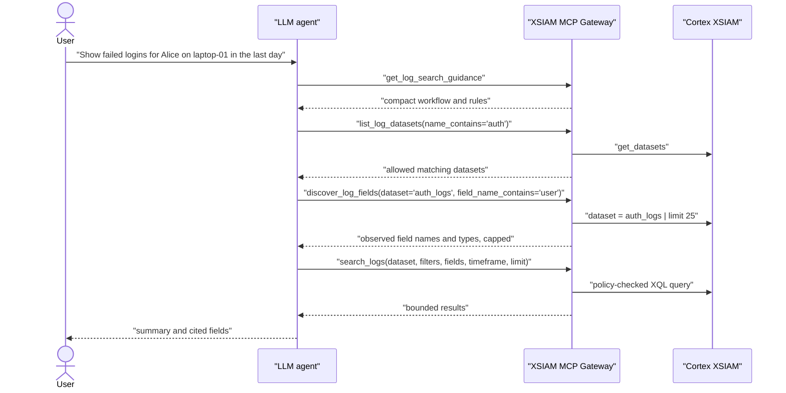

# Agent Log Search

## Design

Claude Code, Codex, or another MCP client agent translates the user's
plain-English request into structured MCP tool calls. The MCP server provides compact
discovery, policy enforcement, XQL execution, and audit logging.

The MCP server should not act as a broad second natural-language interpreter.
It should give the agent enough live context to choose valid datasets and
fields, then validate the resulting request. It does not expose a
`natural_language_query` argument.

## Recommended Agent Flow

## Discovery Tools

| Tool | Purpose | Data minimization |
| --- | --- | --- |
| `get_log_search_guidance` | Returns compact instructions for agent behavior. | No tenant data. |
| `list_log_datasets` | Calls XSIAM `get_datasets` and returns datasets allowed by policy. | Supports `name_contains` and `max_datasets`; returns minimal metadata. |
| `discover_log_fields` | Runs a bounded XQL sample against one allowed dataset and returns observed field names/types. | Caps sample rows and returned fields; does not return sample values. |
| `search_logs` | Executes the final structured query. | Requires explicit dataset, supports field projection and limits. |

Palo Alto documents `POST /public_api/v1/xql/get_datasets` as the API for
retrieving datasets and their properties. Field discovery uses XQL sampling
because available fields can vary by dataset, parser, integration, and time
range.

## Compactness Rules

Agents should:

- narrow dataset discovery with `name_contains` when possible;
- discover fields for one dataset at a time;
- use `field_name_contains` when looking for concepts such as user, host, IP,
  process, severity, URL, or action;
- request only the fields needed to answer the user;
- start with low search limits;
- summarize results instead of returning raw events unless the user explicitly
  asks for details;
- refine with another targeted discovery call when a field is missing.

The MCP server enforces caps on discovery output so a broad tenant schema does
not get dumped into the model context.

## Plain-English Handling

Plain-English handling belongs in Claude Code, Codex, or another MCP client
agent:

1. Agent understands the user request.
2. Agent discovers allowed datasets and observed fields.
3. Agent calls `search_logs` with structured JSON.
4. MCP server enforces policy, executes XQL, and audits the call.

Do not ask the MCP server to translate open-ended prompts into XQL. If the user
request is vague, the agent should ask a clarifying question or run only a small
`dry_run=true` structured search against an allowed dataset.
