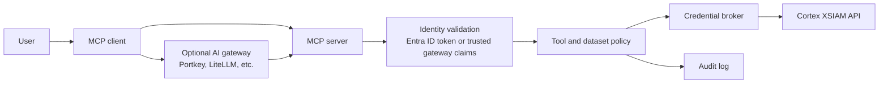

# Architecture

## Overview

Cortex XSIAM MCP Gateway is a FastMCP server that exposes Cortex XSIAM
capabilities to MCP clients. The current implementation supports local stdio
development and centrally hosted HTTP deployments with incoming identity,
tool policy, dataset policy, audit logging, and optional role-scoped XSIAM
credential selection.

An AI gateway such as Portkey or LiteLLM is optional. Teams can deploy this MCP
server directly behind Entra ID token validation, or place it behind an AI
gateway when they already use one for central model routing, policy, telemetry,
or identity forwarding.

## Runtime Components

| Component | Responsibility |
| --- | --- |
| `src/main.py` | Starts the FastMCP server and imports built-in/OpenAPI tools. |
| `src/service/cortex_mcp/server.py` | Creates the FastMCP server and lifespan context. |
| `src/usecase/builtin_components/` | Python tool modules. |
| `src/usecase/builtin_components/openapi/` | OpenAPI fragments converted into MCP tools. |
| `src/usecase/fetcher.py` | Calls XSIAM public APIs. |
| `src/usecase/identity.py` | Validates Entra/gateway identity and maps claims into `MCPContext`. |
| `src/service/cortex_mcp/identity_middleware.py` | Enforces incoming HTTP identity validation. |
| `src/usecase/tool_policy.py` | Enforces group/app-role to MCP tool allowlists. |
| `src/service/cortex_mcp/tool_policy_middleware.py` | Applies tool policy to every MCP tool invocation. |
| `src/usecase/credential_broker.py` | Selects pre-provisioned XSIAM credential profiles by group/app role. |
| `src/usecase/xql_builder.py` | Builds safe structured XQL from validated dataset, field, filter, and limit inputs. |
| `src/usecase/xql_discovery.py` | Normalizes dataset metadata and infers compact field catalogs from bounded XQL samples. |
| `src/usecase/log_policy.py` | Enforces dataset allowlists for log search and privileged raw XQL groups. |
| `src/usecase/audit.py` | Builds audit events and optionally exports them to Cortex XSIAM. |
| `src/service/cortex_mcp/audit_middleware.py` | Emits audit events for every MCP tool invocation. |
| `src/entities/MCPContext.py` | Holds auth headers and principal metadata. |

## Current Request Flow

1. HTTP identity middleware validates an Entra bearer token or trusted gateway
   assertion when HTTP identity mode is enabled.
2. MCP client calls a tool.
3. Audit middleware emits a start event.
4. Tool policy middleware checks `TOOL_ACCESS_POLICY`.
5. Tool-specific policy runs, including dataset and raw-XQL checks.
6. Credential broker selects a pre-provisioned XSIAM credential profile when
   enabled.
7. `Fetcher` calls the XSIAM API.
8. Audit middleware emits success, denied, or error outcome.
9. Tool returns JSON to the MCP client.

## Agent Log Search Flow

1. User gives the LLM agent a plain-English investigation request.
2. Agent calls `get_log_search_guidance` for compact rules.
3. Agent calls `list_log_datasets` to discover allowed datasets.
4. Agent calls `discover_log_fields` for one dataset. The server runs a bounded
   XQL sample and returns capped field metadata, not sample event values.
5. Agent calls `search_logs` with explicit structured parameters.
6. The requested dataset is checked against `LOG_SEARCH_DATASET_POLICY`.
7. The server starts an XQL query.
8. The server polls for results.
9. Results and policy metadata are returned.

## Target Production Flow

1. User signs in with Entra ID.
2. Either the MCP server validates the Entra token directly, or an optional AI
   gateway such as Portkey or LiteLLM validates the user and forwards a trusted
   identity assertion.
3. MCP server validates the direct token or the gateway forwarding contract.
4. User groups/app roles are stored in `MCPContext`.
5. Tool policy decides if the tool can be invoked.
6. Dataset policy decides if the dataset can be queried.
7. Credential broker selects a least-privilege XSIAM API key.
8. XSIAM request is executed.
9. Audit event records principal, role, tool, dataset, decision, and credential profile.
10. Audit event is forwarded to Cortex XSIAM or another durable sink.

## Design Principles

- Fail closed when identity or authorization is uncertain.
- Prefer structured query parameters for agent workflows.
- Keep schema discovery compact and progressive.
- Treat raw XQL as privileged.
- Keep plain-English interpretation in Claude Code or another MCP client agent;
  validate structured calls on the server.
- Avoid one broad XSIAM API key for all users.
- Preserve exact XSIAM data; do not invent security findings.
