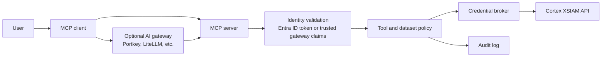

# Architecture

## Overview

Cortex XSIAM MCP Gateway is a FastMCP server that exposes Cortex XSIAM
capabilities to MCP clients. The current implementation runs tools locally with
a configured XSIAM API key. The target production architecture adds identity and
authorization controls before any XSIAM API call.

An AI gateway such as Portkey or LiteLLM is optional. Teams can deploy this MCP
server directly behind Entra ID token validation, or place it behind an AI
gateway when they already use one for central model routing, policy, telemetry,
or identity forwarding.

## Runtime Components

| Component | Responsibility |
| --- | --- |
| `src/main.py` | Starts the FastMCP server and imports built-in/OpenAPI tools. |
| `src/service/cortex_mcp/server.py` | Creates the FastMCP server and lifespan context. |
| `src/usecase/builtin_components/` | Python tool modules. |
| `src/usecase/builtin_components/openapi/` | OpenAPI fragments converted into MCP tools. |
| `src/usecase/fetcher.py` | Calls XSIAM public APIs. |
| `src/usecase/xql_builder.py` | Builds safe structured XQL and conservative NL-to-XQL templates. |
| `src/usecase/log_policy.py` | Enforces dataset allowlists for log search and privileged raw XQL groups. |
| `src/usecase/audit.py` | Builds audit events and optionally exports them to Cortex XSIAM. |
| `src/service/cortex_mcp/audit_middleware.py` | Emits audit events for every MCP tool invocation. |
| `src/entities/MCPContext.py` | Holds auth headers and principal metadata. |

## Current Request Flow

1. MCP client calls a tool.
2. Audit middleware emits a start event.
3. Tool uses the lifespan `MCPContext`.
4. Tool-specific policy runs where implemented.
5. `Fetcher` builds XSIAM API headers.
6. XSIAM API is called with the configured API key.
7. Audit middleware emits success, denied, or error outcome.
8. Tool returns JSON to the MCP client.

## `search_logs` Request Flow

1. User provides raw XQL, structured filters, or a natural-language query.
2. Natural-language input is converted only if it matches safe templates.
3. Structured input is converted to XQL.
4. The requested dataset is checked against `LOG_SEARCH_DATASET_POLICY`.
5. The server starts an XQL query.
6. The server polls for results.
7. Results and policy metadata are returned.

## Target Production Flow

1. User signs in with Entra ID.
2. Either the MCP server validates the Entra token directly, or an optional AI
   gateway such as Portkey or LiteLLM validates the user and forwards a trusted
   identity assertion.
3. MCP server validates the direct token or the gateway forwarding contract.
4. User groups/app roles are stored in `MCPContext`.
5. Tool policy decides if the tool can be invoked.
6. Dataset policy decides if the dataset can be queried.
7. Credential broker selects a least-privilege XSIAM API key.
8. XSIAM request is executed.
9. Audit event records principal, role, tool, dataset, decision, and credential profile.
10. Audit event is forwarded to Cortex XSIAM or another durable sink.

## Design Principles

- Fail closed when identity or authorization is uncertain.
- Prefer structured query parameters for agent workflows.
- Treat raw XQL as privileged.
- Keep natural-language translation explainable and reviewable.
- Avoid one broad XSIAM API key for all users.
- Preserve exact XSIAM data; do not invent security findings.
