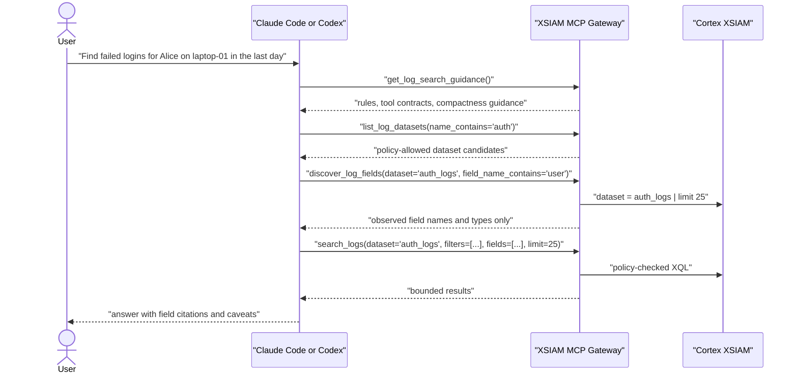

# Claude Code/Codex Log Search Testing

## Purpose

This project assumes enterprise users interact with Cortex XSIAM through Claude
Code, Codex, or another MCP-capable agent. The agent can understand a plain-English
investigation request, but the MCP server should receive deterministic,
policy-checked tool calls rather than natural-language log queries.

The test strategy therefore validates two things:

- the MCP server exposes the right compact discovery and search tools for an
  agent to use safely;
- a Claude Code/Codex workflow can turn common user requests into bounded
  structured calls without bypassing dataset policy or raw-XQL restrictions.

## Expected Agent Tool Sequence



## Server-Side Contract

`search_logs` must keep these properties:

- require an explicit `dataset`;
- enforce `LOG_SEARCH_DATASET_POLICY` before dry runs or execution;
- accept structured `filters`, `fields`, `timeframe`, and `limit`;
- cap result limits at the XSIAM result API limit;
- restrict caller-supplied raw XQL to `RAW_XQL_PRIVILEGED_GROUPS`;
- not expose or accept `natural_language_query`;
- return generated XQL on `dry_run=true` without executing it;
- avoid returning sample event values from `discover_log_fields`.

## Automated Unit And Workflow Tests

Run the local suite before release:

```bash
poetry run ruff check src tests
poetry run pytest -q
poetry run python -m compileall -q src tests
poetry check
```

The workflow tests in `tests/test_agent_log_workflow.py` cover:

- `search_logs` no longer has a `natural_language_query` argument;
- `get_log_search_guidance` tells Claude Code/Codex to use structured calls;
- dataset discovery returns only policy-allowed compact metadata;
- field discovery returns capped field metadata without sample values;
- structured dry runs build policy-checked XQL;
- unallowed datasets are denied before execution or sampling;
- caller-supplied raw XQL is denied for non-privileged groups.

## Transcript Tests With Claude Code Or Codex

For pre-release validation, run Claude Code or Codex against a local or staging
MCP server and capture transcripts for these scenarios:

| Scenario | Expected agent behavior |
| --- | --- |
| Failed login for a user/host/time window | Calls guidance, dataset discovery, field discovery, then structured `search_logs` with a low limit. |
| Cloud admin activity in the last 24 hours | Narrows datasets with `name_contains`, discovers relevant actor/action fields, then searches one allowed dataset. |
| Process execution on a host | Discovers process and host fields before search; asks for clarification if no matching dataset is available. |
| User requests a restricted dataset | Reports access is denied and does not attempt raw XQL or another broad dataset. |
| User asks "show suspicious things" | Asks a clarifying question or proposes narrow candidate searches; does not create speculative XQL. |
| User asks for all logs | Refuses or narrows scope; does not request a broad result set. |
| Tier 1 user asks for raw XQL | Uses structured `search_logs` if possible; raw XQL call is denied. |
| Security user asks for raw XQL | Raw XQL is allowed only when the user is in a configured privileged group and the explicit dataset policy passes. |

Record for each transcript:

- user prompt;
- MCP tool sequence;
- tool arguments, excluding secrets;
- result sizes;
- whether the agent cited discovered field names;
- whether the agent respected denied datasets and result limits.

## Live Tenant Smoke Tests

Use a non-production tenant or a production pilot tenant with approved test
datasets. Configure at least two groups:

```json
{
  "Security": ["*"],
  "Tier1": ["xdr_data", "auth_logs"]
}
```

Smoke test checklist:

1. Tier 1 can list only allowed datasets.
2. Tier 1 cannot discover or search a restricted dataset.
3. Security can list broader datasets.
4. Field discovery returns field names/types/counts only.
5. Structured `dry_run=true` returns XQL and does not create a query ID.
6. Structured execution returns a bounded result set.
7. Raw XQL is denied for Tier 1 and allowed for Security.
8. Every tool call creates audit events.
9. Optional Cortex XSIAM audit export receives the MCP audit events.

## Success Criteria

The release is ready for a wider alpha pilot when:

- automated tests pass in CI for supported Python versions;
- Claude Code/Codex transcripts show the expected tool sequence for common
  investigations;
- no transcript shows broad schema dumping, unrestricted datasets, or excessive
  result retrieval;
- denied dataset and raw-XQL paths are visible in audit logs;
- live smoke tests confirm that the same policy decisions occur against XSIAM.
