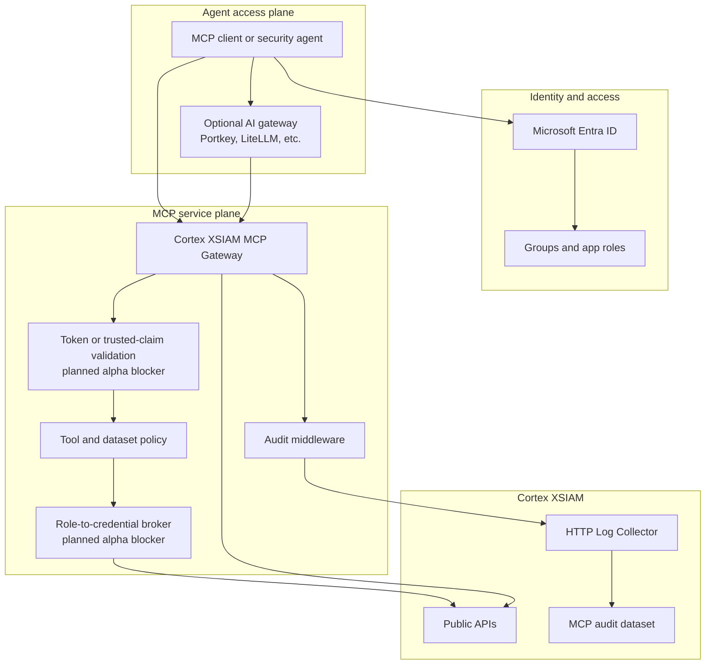

# Enterprise Deployment

## Goal

The target deployment is a centrally operated MCP service for many users and
agents. Local per-user execution is useful for development, but it is not the
enterprise operating model because it spreads credentials, weakens central
policy, and fragments audit evidence.

## Reference Architecture

## Direct Mode

Direct mode is the simplest enterprise shape once Entra validation is complete:

1. User authenticates with Entra ID.
2. MCP client sends a bearer token to the HTTP MCP endpoint.
3. MCP gateway validates issuer, audience, signature, expiry, and required
   claims.
4. Groups/app roles become the authorization input.
5. Policy evaluates tool, dataset, and credential access.

Direct mode does not require Portkey, LiteLLM, or any other AI gateway.

## Optional AI Gateway Mode

Use an AI gateway when it is already part of the enterprise AI control plane.
Common reasons are central model routing, usage accounting, prompt logging,
policy enforcement, or a standard place to attach identity.

Gateway mode must still be verifiable:

- The gateway must authenticate the user.
- The gateway must forward a stable principal and group/role claims.
- The MCP gateway must validate that the forwarded identity came from a trusted
  gateway, not from arbitrary client headers.
- The MCP gateway must still apply its own tool, dataset, credential, and audit
  policy.

## Deployment Requirements

Minimum production requirements before broad rollout:

- TLS termination and private network placement.
- Entra token validation or trusted gateway identity validation.
- No development default groups in production.
- Dataset policy mapped to real groups/app roles.
- Raw XQL restricted to security/admin roles.
- Audit logging enabled.
- Audit logs exported to a durable system, preferably Cortex XSIAM.
- Secrets stored in a managed secret store.
- Separate XSIAM credentials per environment.

## Current Alpha Limitations

- Entra token validation is not implemented yet.
- Optional gateway identity-forwarding validation is not implemented yet.
- The credential broker is not implemented yet.
- Tool-level authorization is complete only for log search and raw XQL.
- Local development defaults still exist and must not be used as production
  authorization.

