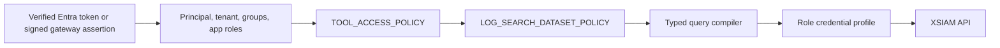

# RBAC And Dataset Query Review

## Capability

The gateway can query XSIAM logs and any other XSIAM dataset exposed to XQL.
The preferred agent path is `query_dataset`, which compiles a typed plan for one
explicit policy-authorized dataset. `execute_xql_query` remains a privileged
escape hatch.

## Authorization Chain

1. HTTP identity middleware validates Entra bearer tokens or signed optional
   gateway assertions.
2. Tool middleware authorizes every built-in and OpenAPI-generated tool.
3. Discovery and query tools authorize the explicit dataset before making an
   XSIAM call.
4. Typed query models reject unknown arguments, identifiers, operators,
   functions, and incompatible row/aggregate shapes.
5. The credential broker deterministically selects a pre-provisioned profile by
   numeric priority and fails closed when no profile matches.
6. Audit middleware records start and end outcomes with the actual selected
   credential profile.

Raw XQL has an additional guard: the principal needs a configured privileged
group and a `*` dataset grant. This avoids pretending that arbitrary joins and
subqueries can be securely authorized by parsing one declared dataset.

## Agent Query Tools

- `get_dataset_query_guidance`: compact client-agent rules.
- `get_xql_help`: focused typed/XQL recipes.
- `list_log_datasets`: policy-filtered dataset discovery.
- `discover_log_fields`: observed field metadata from a bounded sample, without
  sample values.
- `query_dataset`: typed rows, filters, aggregates, top-N, and time trends.
- `continue_dataset_query`: cursor-only bounded keyset continuation.
- `search_logs`: compatibility row-search wrapper with no raw query or tenant
  arguments.
- `execute_xql_query`: privileged raw XQL.
- `get_xql_query_quota`: operational quota visibility.

The client agent maps plain English to these tools. The server does not run an
LLM to generate XQL.

## Dataset And Field Discovery

Palo Alto documents `POST /public_api/v1/xql/get_datasets` for dataset
discovery. Field names are sampled because schemas can be sparse and vary by
parser, integration, and timeframe. Sampling is guidance, not a full schema
guarantee.

Dataset authorization runs before sampling. The response contains field names,
inferred serialized types, and observed counts, but not the sampled values.

## Query And Pagination Controls

The typed compiler supports:

- row projection;
- AND/OR typed filters;
- `count`, `count_distinct`, `sum`, `avg`, `min`, and `max`;
- grouping, top-N sorting, and minute/hour/day buckets;
- relative or absolute timeframes;
- up to two deterministic keyset sort fields.

The executor caps one response at configured row, field, cell, and byte limits,
polls under a deadline, and cannot exceed four process-local XQL queries. It
does not auto-stream or auto-exhaust result pages.

Continuation cursors are encrypted, expire, and bind to the principal, tenant,
auth source, groups, query plan, and policy hash. Policy is rechecked on every
page. XSIAM timestamp values serialized as epoch milliseconds are converted
back to timestamps in seek predicates.

## XSIAM XQL APIs

- [Start an XQL query](https://docs-cortex.paloaltonetworks.com/r/Cortex-XSIAM-REST-API/Start-an-XQL-query)
- [Get XQL query results](https://docs-cortex.paloaltonetworks.com/r/Cortex-XSIAM-REST-API/Get-XQL-query-results)
- [Get XQL query results stream](https://docs-cortex.paloaltonetworks.com/r/Cortex-XSIAM-REST-API/Get-XQL-query-results-Stream)
- [Get XQL query quota](https://docs-cortex.paloaltonetworks.com/r/Cortex-XSIAM-REST-API/Get-XQL-query-Quota)
- [Get all datasets](https://docs-cortex.paloaltonetworks.com/r/Cortex-XSIAM-REST-API/Get-all-datasets)
- [XQL command reference](https://docs-cortex.paloaltonetworks.com/r/Cortex/Cortex-XQL-Command-Reference)

The non-streaming results API is used deliberately for bounded agent answers.
Streaming remains a future controlled export/investigation feature, not the
default MCP response path.

## Credential Model

Users do not need personal XSIAM API keys. The service can use one constrained
service credential when server-side policy is the enforcement layer, or select
from pre-provisioned role/group profiles for defense in depth. The gateway does
not dynamically create per-user keys.

## Remaining Gaps

- Field-level role-based output redaction is not implemented.
- Streaming export is not implemented.
- Query semaphore, replay cache, and cursor cryptography are process-local;
  multi-replica deployments need shared rate/replay controls and consistent
  secrets.
- Each deployment must validate its own Entra claims, group mappings, gateway
  contract, credential permissions, and audit collector.
