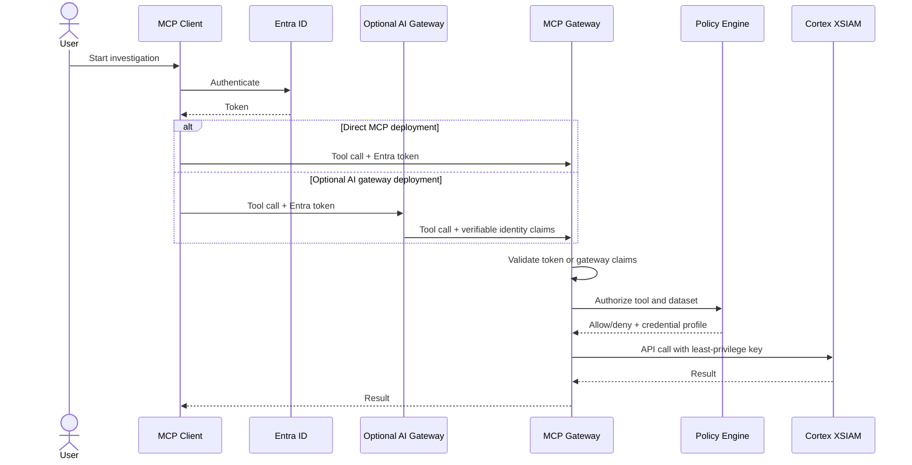

# Security Model

## Current State

The current implementation authenticates to XSIAM with either a configured
default API key or a role/group-scoped credential profile selected by the
credential broker.

For HTTP transport, incoming users can be authenticated through Entra bearer
JWT validation, HMAC-signed trusted gateway identity forwarding, or either path
when `MCP_IDENTITY_AUTH_MODE=entra_or_gateway`.

Every MCP tool invocation is checked against `TOOL_ACCESS_POLICY`.
`query_dataset`, `search_logs`, and discovery tools enforce dataset allowlists
using verified groups/app roles from `MCPContext`. `execute_xql_query` requires
both a privileged group and an all-datasets policy grant. Every MCP tool call is
audited through middleware, with optional export to a Cortex XSIAM HTTP Log
Collector.

In local stdio development, groups can come from environment defaults. In
production HTTP deployments, groups must come from verified identity claims.

## Target State

The target security model supports two deployment modes:

- Direct mode: the MCP server validates Entra ID tokens from the MCP client.
- Gateway mode: an optional AI gateway such as Portkey or LiteLLM validates the
  user, routes the request, and forwards identity claims that the MCP server can
  verify.

Gateway mode is useful for organizations that already centralize AI traffic, but
it is not required for teams that can connect MCP clients directly to this
server.



## Authorization Layers

| Layer | Purpose |
| --- | --- |
| Identity | Verify the human or service calling MCP. |
| Tool policy | Decide which tools can be invoked. |
| Dataset policy | Decide which XSIAM datasets can be queried. |
| Credential policy | Select a pre-provisioned least-privilege XSIAM API credential. |
| Output controls | Suppress unrequested fields and enforce row, field, cell, and byte budgets. Field-level role policy is a future layer. |
| Audit | Record every tool invocation and policy outcome. |

## Dataset Policy

Dataset policy is checked before dataset discovery, field sampling, typed query
compilation/execution, continuation, and compatibility `search_logs` calls.

Example:

```json
{
  "Security": ["*"],
  "Tier1": ["xdr_data"]
}
```

`Security` can query all datasets. `Tier1` can query only `xdr_data`.

Typed queries still require one explicit dataset even for principals with `*`.
Raw XQL is not parsed for authorization; instead it is limited to principals
that already have both raw-XQL privilege and `*` dataset access. Every raw
query must end with a numeric limit stage, which is clamped before submission
so synchronous and polled result paths share the same row bound.

## Query And Result Controls

`query_dataset` compiles allowlisted operators and aggregate functions rather
than accepting an XQL string. It enforces:

- explicit row projections;
- server caps for filters, metrics, grouping, fields, rows, cell length,
  response bytes, and timeframe;
- a process-level semaphore hard-capped at four concurrent XQL queries;
- timeout-bounded polling;
- removal of any columns XSIAM returns outside the requested projection;
- metadata-only upstream HTTP and XQL failure errors so XSIAM response bodies
  and query error details cannot echo queries, filters, or tenant data into MCP
  responses or logs;
- untrusted-data provenance on returned rows.

Continuation uses an encrypted keyset cursor instead of an offset. The cursor
contains no plaintext plan, is time-limited, and is bound to principal, tenant,
auth source, groups, and dataset-policy hash. Dataset authorization is checked
again on every continuation call.

## Audit Logging

Tool invocation audit is implemented. It records principal, groups, tool,
outcome, dataset, argument hashes, duration, and the selected nonsecret XSIAM
credential profile. Cortex XSIAM SIEM export is supported through an HTTP Log
Collector.

Raw XQL is hashed by default. Full query logging requires
`AUDIT_LOG_INCLUDE_QUERY_TEXT=true`.

## Credential Policy

The credential broker does not dynamically provision per-user API keys. It
selects from pre-provisioned XSIAM API key profiles mapped to groups/app roles.
If the broker is enabled and no profile matches the verified principal, tool
execution fails closed.

## Known Gaps

- Field-level role-based redaction is not implemented; output projection and
  size minimization are implemented.
- Large result streaming is not implemented.
- Live enterprise validation is still required for each tenant-specific Entra,
  gateway, dataset, tool, credential, and audit-export configuration.

## Threat Model Summary

Primary risks:

- broad API key misuse;
- unauthorized dataset search;
- malicious or overbroad agent-generated query plans;
- leakage of query results to unauthorized users;
- prompt injection causing unsafe tool use;
- credential profile misconfiguration.
- replay of trusted-gateway assertions;
- cursor reuse after identity or policy changes;
- oversized or unbounded XQL result retrieval.

Core mitigations:

- verify identity before tool use;
- fail closed on policy ambiguity;
- restrict raw XQL;
- require explicit dataset declarations;
- use least-privilege API keys;
- log all authorization decisions;
- reject replayed gateway nonces;
- bind continuation to identity and policy state;
- bound query concurrency and all client-visible results;
- keep plain-English interpretation in the client agent and validate structured
  calls on the server.
