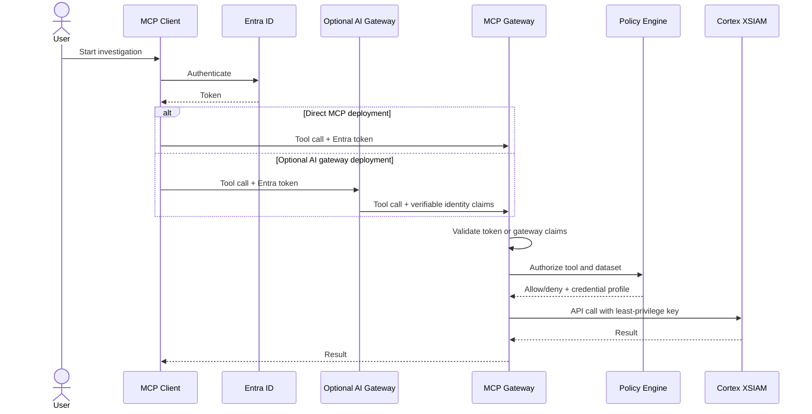

# Security Model

## Current State

The current implementation authenticates to XSIAM with either a configured
default API key or a role/group-scoped credential profile selected by the
credential broker.

For HTTP transport, incoming users can be authenticated through Entra bearer
JWT validation, HMAC-signed trusted gateway identity forwarding, or either path
when `MCP_IDENTITY_AUTH_MODE=entra_or_gateway`.

Every MCP tool invocation is checked against `TOOL_ACCESS_POLICY`.
`search_logs` also enforces dataset allowlists using verified groups/app roles
from `MCPContext`. `execute_xql_query` and caller-supplied raw XQL through
`search_logs(query=...)` are restricted to privileged groups. Every MCP tool
call is audited through middleware, with optional export to a Cortex XSIAM HTTP
Log Collector.

In local stdio development, groups can come from environment defaults. In
production HTTP deployments, groups must come from verified identity claims.

## Target State

The target security model supports two deployment modes:

- Direct mode: the MCP server validates Entra ID tokens from the MCP client.
- Gateway mode: an optional AI gateway such as Portkey or LiteLLM validates the
  user, routes the request, and forwards identity claims that the MCP server can
  verify.

Gateway mode is useful for organizations that already centralize AI traffic, but
it is not required for teams that can connect MCP clients directly to this
server.



## Authorization Layers

| Layer | Purpose |
| --- | --- |
| Identity | Verify the human or service calling MCP. |
| Tool policy | Decide which tools can be invoked. |
| Dataset policy | Decide which XSIAM datasets can be queried. |
| Credential policy | Select a pre-provisioned least-privilege XSIAM API credential. |
| Output policy | Redact or suppress fields not allowed for the caller. |
| Audit | Record every tool invocation and policy outcome. |

## Dataset Policy

Dataset policy is implemented for `search_logs`.

Example:

```json
{
  "Security": ["*"],
  "Tier1": ["xdr_data"]
}
```

`Security` can query all datasets. `Tier1` can query only `xdr_data`.

## Audit Logging

Tool invocation audit is implemented. It records principal, groups, tool,
outcome, dataset, argument hashes, duration, and XSIAM API key ID hash. Cortex
XSIAM SIEM export is supported through an HTTP Log Collector.

Raw XQL is hashed by default. Full query logging requires
`AUDIT_LOG_INCLUDE_QUERY_TEXT=true`.

## Credential Policy

The credential broker does not dynamically provision per-user API keys. It
selects from pre-provisioned XSIAM API key profiles mapped to groups/app roles.
If the broker is enabled and no profile matches the verified principal, tool
execution fails closed.

## Known Gaps

- Output redaction is not implemented.
- Large result streaming is not implemented.
- Live enterprise validation is still required for each tenant-specific Entra,
  gateway, dataset, tool, credential, and audit-export configuration.

## Threat Model Summary

Primary risks:

- broad API key misuse;
- unauthorized dataset search;
- malicious or overbroad agent-generated query plans;
- leakage of query results to unauthorized users;
- prompt injection causing unsafe tool use;
- credential profile misconfiguration.

Core mitigations:

- verify identity before tool use;
- fail closed on policy ambiguity;
- restrict raw XQL;
- require explicit dataset declarations;
- use least-privilege API keys;
- log all authorization decisions;
- keep plain-English interpretation in the client agent and validate structured
  calls on the server.
