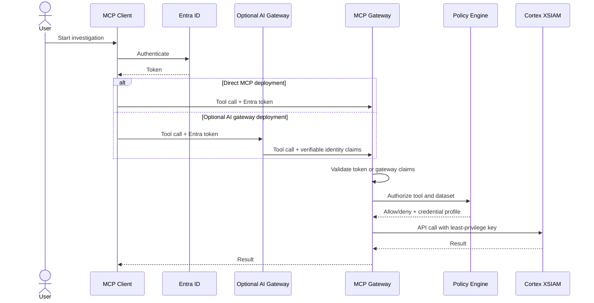

# Security Model

## Current State

The current implementation authenticates to XSIAM with a configured API key and
API key ID. Incoming MCP users are not yet authenticated by Entra ID. Optional
AI gateway identity forwarding, such as Portkey or LiteLLM, is also not yet
implemented.

`search_logs` enforces dataset allowlists using groups from `MCPContext`.
`execute_xql_query` is restricted to privileged groups. Every MCP tool call is
audited through middleware, with optional export to a Cortex XSIAM HTTP Log
Collector.

In development, groups come from environment defaults. In production, they must
come from verified identity claims.

## Target State

The target security model supports two deployment modes:

- Direct mode: the MCP server validates Entra ID tokens from the MCP client.
- Gateway mode: an optional AI gateway such as Portkey or LiteLLM validates the
  user, routes the request, and forwards identity claims that the MCP server can
  verify.

Gateway mode is useful for organizations that already centralize AI traffic, but
it is not required for teams that can connect MCP clients directly to this
server.



## Authorization Layers

| Layer | Purpose |
| --- | --- |
| Identity | Verify the human or service calling MCP. |
| Tool policy | Decide which tools can be invoked. Implemented for raw XQL only. |
| Dataset policy | Decide which XSIAM datasets can be queried. |
| Credential policy | Select the least-privilege XSIAM API credential. |
| Output policy | Redact or suppress fields not allowed for the caller. |
| Audit | Record every tool invocation and policy outcome. |

## Dataset Policy

Dataset policy is implemented for `search_logs`.

Example:

```json
{
  "Security": ["*"],
  "Tier1": ["xdr_data"]
}
```

`Security` can query all datasets. `Tier1` can query only `xdr_data`.

## Audit Logging

Tool invocation audit is implemented. It records principal, groups, tool,
outcome, dataset, argument hashes, duration, and XSIAM API key ID hash. Cortex
XSIAM SIEM export is supported through an HTTP Log Collector.

Raw XQL and natural-language prompts are hashed by default. Full query logging
requires `AUDIT_LOG_INCLUDE_QUERY_TEXT=true`.

## Known Gaps

- Incoming Entra authentication is not implemented.
- Optional Portkey/LiteLLM-style gateway identity forwarding is not
  implemented.
- Per-role XSIAM credential selection is not implemented.
- Tool-level authorization is not implemented for every tool.
- Output redaction is not implemented.
- Large result streaming is not implemented.

## Threat Model Summary

Primary risks:

- broad API key misuse;
- unauthorized dataset search;
- malicious or overbroad natural-language-to-XQL translation;
- leakage of query results to unauthorized users;
- prompt injection causing unsafe tool use;
- incomplete tool-level authorization.

Core mitigations:

- verify identity before tool use;
- fail closed on policy ambiguity;
- restrict raw XQL;
- require explicit dataset declarations;
- use least-privilege API keys;
- log all authorization decisions;
- keep natural-language translation deterministic or policy-validated.
